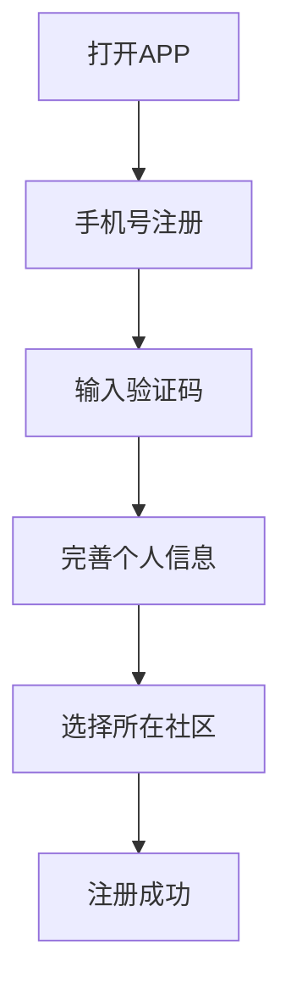
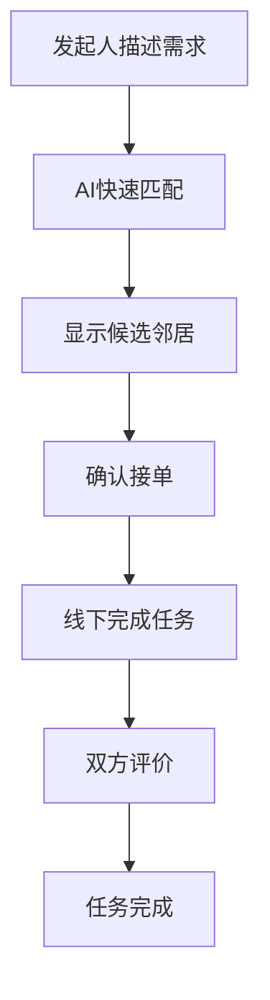
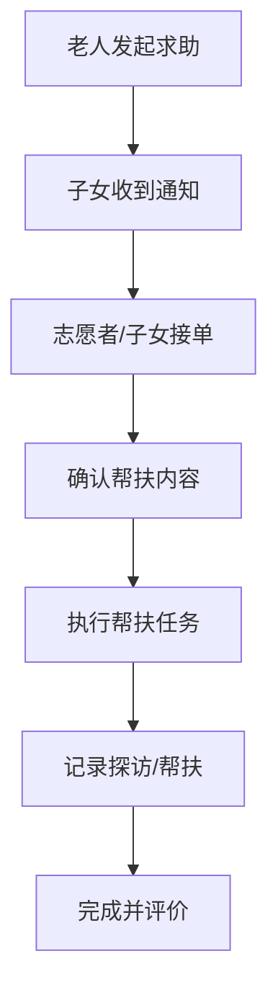

# 邻里社区APP产品需求文档

## 1. 产品概述

**项目名称**: 邻里社区（Linli Community）

**项目简介**: 一款连接城市社区居民的本地化社交与互助平台，致力于打破小区围墙，让邻居走出家门，实现社区资源自由流动。

**核心价值**: "连接邻里，共建美好社区"

**目标用户**:
- 城市社区居民（核心用户）
- 社区志愿者和老年人家属
- 有创业意愿的社区居民

**市场价值**:
- 解决城市"陌生人社会"问题，重建邻里信任
- 挖掘社区闲置劳动力，创造本地化灵活就业机会
- 为社区老年人提供科技赋能的关怀服务

---

## 2. 核心功能模块

### 2.1 用户角色

| 角色 | 注册方式 | 核心权限 |
|------|----------|----------|
| 社区居民 | 手机号注册/微信登录 | 使用全部基础功能，发起互助和创业 |
| 老年用户 | 手机号注册 + 子女协助 | 发起求助、使用关怀功能 |
| 志愿者 | 社区认证 | 认领帮扶任务、参与关怀活动 |
| 商家/创业者 | 实名认证 | 发布商品和服务 |

### 2.2 功能模块

1. **首页**: 发现邻里动态、参与热门活动
2. **邻里空间**: 社区客厅、活动中心、兴趣小组
3. **AI劳动撮合**: 快速匹配互助任务（取快递、帮买菜等）
4. **社区创业**: 兴趣变现、私房菜、烘焙、小手艺
5. **老人关怀**: 志愿者帮扶、定期探访、紧急求助
6. **我的**: 个人中心、发布的任务、订单管理

---

## 3. 核心页面详情

### 3.1 首页（Home）

| 模块名称 | 功能描述 |
|----------|----------|
| 顶部搜索栏 | 搜索邻里、任务、活动 |
| 轮播公告 | 社区重要通知、活动推广 |
| 快捷入口 | 4个核心功能入口图标 |
| 动态feed | 邻居最新动态、互助进度 |
| 热门活动 | 推荐中的社区活动卡片 |

### 3.2 邻里空间（Neighborhood）

| 模块名称 | 功能描述 |
|----------|----------|
| 社区客厅 | 线上茶水间，邻居聊天 |
| 活动中心 | 发起/报名线下活动 |
| 兴趣小组 | 按兴趣加入小组（遛狗、美食等） |
| 邻里排行榜 | 活跃邻居榜单 |

### 3.3 AI劳动撮合（AI Helper）

| 模块名称 | 功能描述 |
|----------|----------|
| 快速发起 | 一句话描述需求，AI自动匹配 |
| 任务广场 | 邻居发布的可接任务 |
| 我的任务 | 发起中/进行中/已完成 |
| 信用评价 | 双向评价系统 |

### 3.4 社区创业（Business）

| 模块名称 | 功能描述 |
|----------|----------|
| 我的小店 | 开通个人微店 |
| 商品发布 | 烘焙、私房菜、手工艺品等 |
| 邻里订单 | 附近邻居下单 |
| 创业学院 | 社区创业指南 |

### 3.5 老人关怀（Elderly Care）

| 模块名称 | 功能描述 |
|----------|----------|
| 紧急求助 | 一键呼叫志愿者 |
| 定期探访 | 志愿者排班探访记录 |
| 帮买菜 | 预约代购服务 |
| 陪诊服务 | 陪同就医服务 |
| 暖心陪聊 | 视频/语音陪伴 |

### 3.6 个人中心（Profile）

| 模块名称 | 功能描述 |
|----------|----------|
| 个人信息 | 头像、昵称、地址 |
| 我的发布 | 发起的任务和活动 |
| 我的参与 | 参与的活动和互助 |
| 钱包 | 余额、积分 |
| 设置 | 消息通知、隐私设置 |

---

## 4. 核心流程

### 4.1 用户注册流程

### 4.2 互助任务流程

### 4.3 老人帮扶流程

---

## 5. 界面设计规范

### 5.1 设计风格

- **整体风格**: 温暖、亲近、信任感
- **主色调**: 橙色系 (#FF8C42) - 代表热情与温暖
- **辅助色**: 绿色 (#4CAF50) - 代表信任与活力
- **中性色**: 米白 (#F5F5F0) - 干净舒适
- **字体**: 思源黑体（中文）+ Helvetica（英文）
- **圆角风格**: 大圆角卡片 (16px)，柔和亲切
- **图标风格**: 线性图标 + 填充图标结合

### 5.2 布局方式

- **导航**: 底部Tab导航（5个核心入口）
- **内容**: 卡片式布局，瀑布流动态
- **间距**: 宽松间距，呼吸感强
- **动效**: 轻微弹性动画，强调亲和力

### 5.3 响应式设计

- **移动端优先**: 适配手机全屏
- **H5适配**: 支持微信、浏览器等环境
- **平板适配**: 底部导航适配

---

## 6. 页面列表

| 页面名称 | 路由 | 描述 |
|----------|------|------|
| 首页 | /pages/index/index | 发现页、动态feed |
| 邻里空间 | /pages/neighborhood/index | 社区客厅、活动 |
| AI互助 | /pages/ai-helper/index | 快速发起任务 |
| 任务详情 | /pages/ai-helper/detail | 任务详情 |
| 社区创业 | /pages/business/index | 商家入驻、商品 |
| 老人关怀 | /pages/elderly/index | 帮扶功能 |
| 我的 | /pages/profile/index | 个人中心 |
| 设置 | /pages/profile/settings | 设置页 |
| 登录 | /pages/login/index | 登录注册 |
