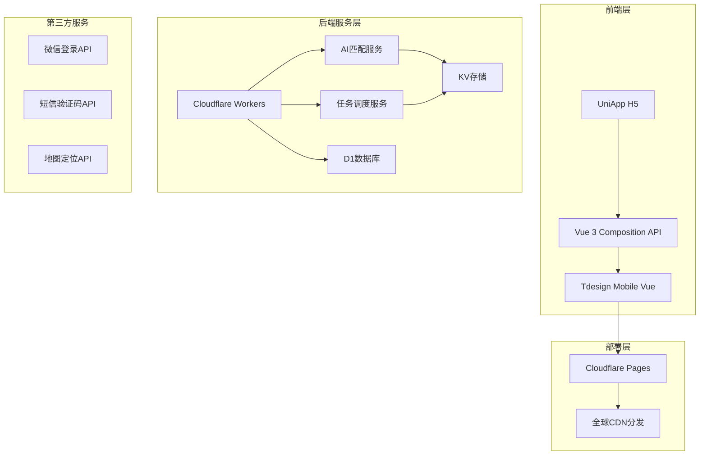

# 邻里社区APP技术架构文档

## 1. 架构设计



## 2. 技术栈

| 层级 | 技术选型 | 说明 |
|------|----------|------|
| 跨端框架 | UniApp + Vue 3 | 支持H5、小程序多端 |
| UI组件 | TDesign Mobile Vue | 腾讯开源移动端组件库 |
| 构建工具 | Vite + HBuilderX | 高速构建 |
| 后端Runtime | Cloudflare Workers | 边缘计算 |
| 数据库 | Cloudflare D1 | SQLite边缘数据库 |
| KV存储 | Cloudflare KV | 高性能键值存储 |
| AI服务 | Cloudflare Workers AI | 本地AI推理 |
| 部署平台 | Cloudflare Pages | 静态站点托管 |
| 域名 | 需用户配置 | 指向Cloudflare |

## 3. 路由定义

| 路由 | 页面名称 | 描述 |
|------|----------|------|
| /pages/index/index | 首页 | 发现页 |
| /pages/neighborhood/index | 邻里空间 | 社区客厅 |
| /pages/ai-helper/index | AI互助 | 发起任务 |
| /pages/ai-helper/detail | 任务详情 | 查看任务 |
| /pages/business/index | 社区创业 | 商家商品 |
| /pages/elderly/index | 老人关怀 | 帮扶功能 |
| /pages/profile/index | 个人中心 | 我的 |
| /pages/login/index | 登录 | 注册登录 |

## 4. API定义

### 4.1 用户相关

```typescript
// 用户登录
POST /api/auth/login
Request: { phone: string, code: string }
Response: { token: string, user: User }

// 用户信息
GET /api/user/profile
Response: { id: string, name: string, avatar: string, community: string }
```

### 4.2 任务相关

```typescript
// 创建任务
POST /api/tasks
Request: { title: string, description: string, type: string, reward: number }
Response: { taskId: string }

// 匹配任务
GET /api/tasks/match?taskId={id}
Response: { matches: User[] }

// 接单任务
POST /api/tasks/{id}/accept
Response: { success: boolean }

// 完成评价
POST /api/tasks/{id}/complete
Request: { rating: number, comment: string }
```

### 4.3 社区相关

```typescript
// 获取社区动态
GET /api/community/feed?page=1&limit=20
Response: { posts: Post[] }

// 发布动态
POST /api/community/posts
Request: { content: string, images: string[] }

// 活动列表
GET /api/community/activities
Response: { activities: Activity[] }

// 报名活动
POST /api/activities/{id}/join
```

### 4.4 创业相关

```typescript
// 我的小店
GET /api/business/shop
Response: { shop: Shop, products: Product[] }

// 发布商品
POST /api/business/products
Request: { name: string, price: number, description: string, images: string[] }

// 订单列表
GET /api/business/orders
```

### 4.5 老人关怀

```typescript
// 发起帮扶请求
POST /api/elderly/help
Request: { type: string, description: string, urgent: boolean }

// 帮扶记录
GET /api/elderly/records
Response: { records: HelpRecord[] }

// 志愿者排班
GET /api/elderly/schedule
```

## 5. 数据模型

### 5.1 ER图

```mermaid
erDiagram
    User ||--o{ Task : creates
    User ||--o{ Task : accepts
    User ||--o{ Post : creates
    User ||--o{ Order : places
    User ||--o{ HelpRecord : receives
    Community ||--o{ User : contains
    Community ||--o{ Task : has
    Community ||--o{ Post : has
    Shop |||--|{ Product : sells
    Shop ||--o{ Order : receives
```

### 5.2 数据表定义

```sql
-- 用户表
CREATE TABLE users (
    id TEXT PRIMARY KEY,
    phone TEXT UNIQUE,
    name TEXT,
    avatar TEXT,
    community_id TEXT,
    role TEXT DEFAULT 'resident',
    created_at INTEGER
);

-- 社区表
CREATE TABLE communities (
    id TEXT PRIMARY KEY,
    name TEXT,
    address TEXT,
    longitude REAL,
    latitude REAL,
    created_at INTEGER
);

-- 任务表
CREATE TABLE tasks (
    id TEXT PRIMARY KEY,
    title TEXT,
    description TEXT,
    type TEXT,
    reward INTEGER,
    status TEXT DEFAULT 'open',
    creator_id TEXT,
    acceptor_id TEXT,
    community_id TEXT,
    created_at INTEGER,
    completed_at INTEGER
);

-- 动态表
CREATE TABLE posts (
    id TEXT PRIMARY KEY,
    user_id TEXT,
    content TEXT,
    images TEXT,
    community_id TEXT,
    likes INTEGER DEFAULT 0,
    created_at INTEGER
);

-- 商店表
CREATE TABLE shops (
    id TEXT PRIMARY KEY,
    owner_id TEXT,
    name TEXT,
    description TEXT,
    status TEXT DEFAULT 'active',
    created_at INTEGER
);

-- 商品表
CREATE TABLE products (
    id TEXT PRIMARY KEY,
    shop_id TEXT,
    name TEXT,
    price REAL,
    description TEXT,
    images TEXT,
    created_at INTEGER
);

-- 帮扶记录表
CREATE TABLE help_records (
    id TEXT PRIMARY KEY,
    elder_id TEXT,
    volunteer_id TEXT,
    type TEXT,
    description TEXT,
    status TEXT DEFAULT 'pending',
    created_at INTEGER,
    completed_at INTEGER
);
```

## 6. 部署架构

### 6.1 Cloudflare Pages部署

```
HBuilder构建 → dist目录 → Cloudflare Pages连接GitHub → 自动部署
```

### 6.2 Cloudflare Workers部署

```
API路由: /api/* → Workers处理 → D1/KV存储
AI路由: /ai/* → Workers AI推理
```

### 6.3 环境变量

| 变量名 | 说明 |
|--------|------|
| D1_DATABASE | D1数据库ID |
| KV_NAMESPACE | KV存储命名空间 |
| AI_TOKEN | AI服务Token |

---

## 7. 项目结构

```
linli-community/
├── pages/                 # 页面目录
│   ├── index/            # 首页
│   ├── neighborhood/     # 邻里空间
│   ├── ai-helper/        # AI互助
│   ├── business/         # 社区创业
│   ├── elderly/          # 老人关怀
│   └── profile/           # 个人中心
├── components/           # 组件目录
├── static/               # 静态资源
├── utils/                # 工具函数
├── api/                  # API请求
├── cloudflare/           # Workers代码
│   └── functions/        # 边缘函数
├── manifest.json         # UniApp配置
├── pages.json            # 路由配置
└── package.json
```
