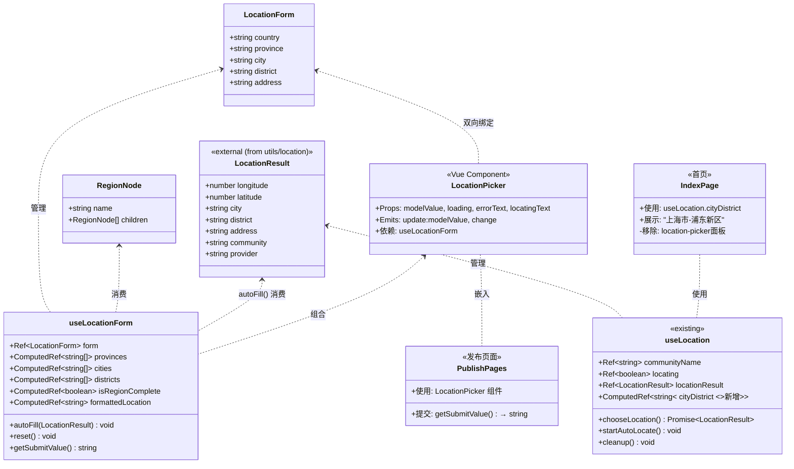
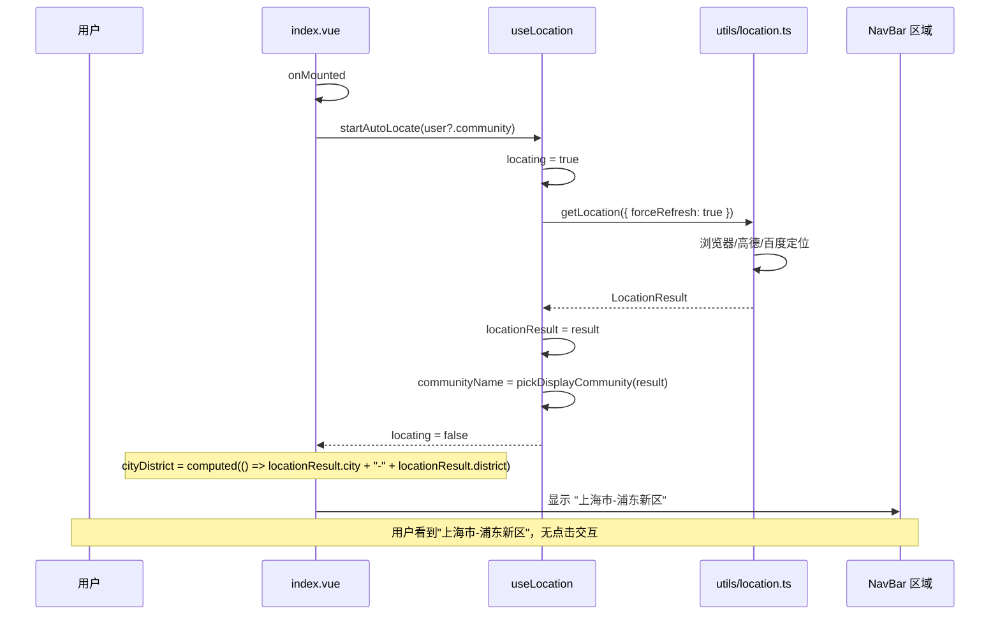
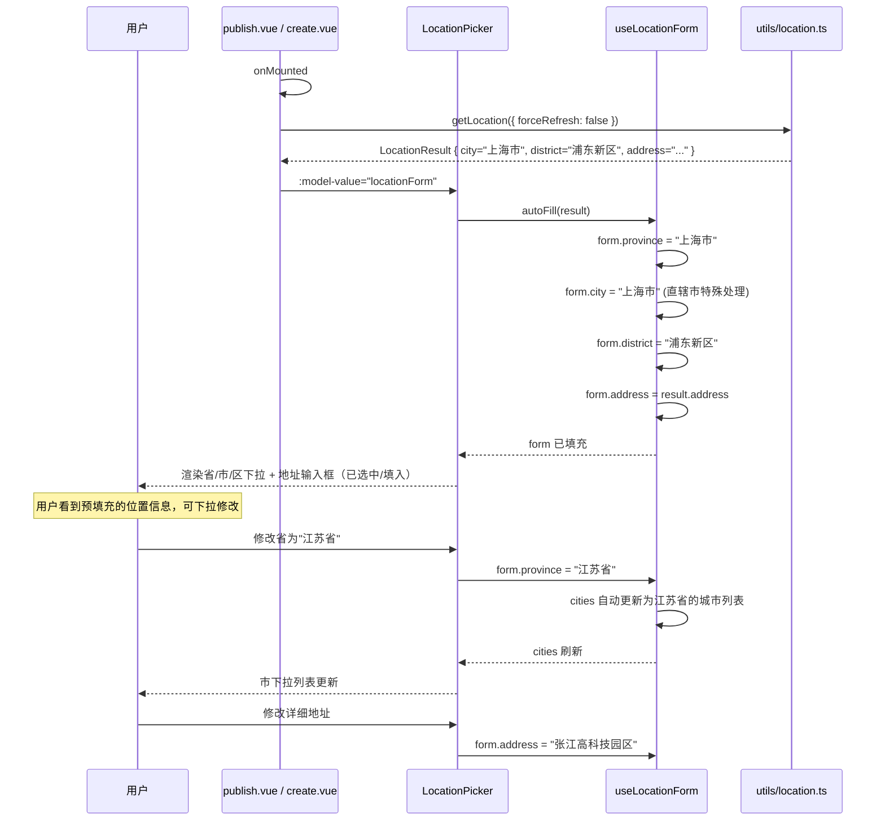
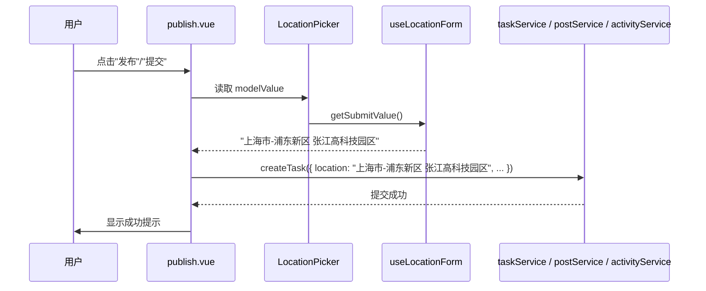
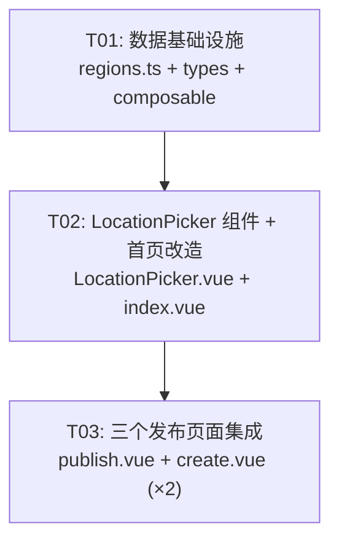

# 邻里社区APP — 定位功能重构 · 架构设计文档

> **版本**: v1.0  
> **项目**: 邻里社区APP（Vue 3 + TypeScript + Vite）  
> **架构师**: Bob  
> **日期**: 2025-07  

---

## Part A: 系统设计

---

### 1. 实现方案

#### 1.1 核心难点分析

| 难点 | 说明 | 方案 |
|------|------|------|
| **省市区级联数据** | 需要内置中国省市区三级数据，数据量大 | 只覆盖常用省市区（一线+新一线城市），减小 bundle |
| **级联选择逻辑** | 选省→市列表联动，选市→区列表联动 | Vue computed 属性驱动，纯前端无网络请求 |
| **自动定位匹配** | 定位结果 city/district 需自动 match 到下拉选项 | 用 `LocationResult.city/district` 做字符串匹配，找不到时默认选中第一项 |
| **三页面复用** | 3 个发布页面位置选择逻辑相同，避免重复代码 | 抽离 `LocationPicker.vue` 组件 + `useLocationForm` composable |
| **首页简化** | 移除 location-picker 底部面板，改为纯展示 | 复用 `useLocation` 的 `locationResult`，直接显示 `city - district` |

#### 1.2 框架与库选型

| 类别 | 选型 | 理由 |
|------|------|------|
| UI 框架 | Vue 3 (Composition API) | 项目已用，不做变更 |
| 语言 | TypeScript | 项目已用，不做变更 |
| 省市区数据 | 内置 JSON（`src/constants/regions.ts`） | 无需额外 npm 包，纯静态数据 |
| 组件复用 | Vue SFC + Props/Emits | 标准 Vue 3 组件化方案 |
| 状态管理 | Composable（`useLocationForm`） | 轻量，不引入 Pinia/Vuex 等额外依赖 |
| 定位能力 | 复用现有 `utils/location.ts` + `useLocation` | 已有完整定位链路（高德/百度/浏览器兜底） |

**无需新增 npm 包。** 所有功能通过项目现有依赖 + 内置数据实现。

#### 1.3 架构模式

```
组合式架构（Composition API + Component）
┌─────────────────────────────────────────────────────────┐
│  Pages                                                    │
│  ┌───────────┐  ┌───────────────┐  ┌─────────────┐       │
│  │ index.vue │  │ ai-helper/    │  │ post/       │       │
│  │ (首页)    │  │ publish.vue   │  │ create.vue  │       │
│  └─────┬─────┘  └───────┬───────┘  └──────┬──────┘       │
│        │                │                 │              │
│        │          ┌─────▼──────────┐      │              │
│        │          │ LocationPicker │◄─────┘              │
│        │          │  (组件复用)     │                     │
│        │          └─────┬──────────┘                     │
│        │                │                                │
│  ┌─────▼────────────────▼──────────────────────────┐     │
│  │         Composables                               │     │
│  │  ┌────────────────┐   ┌──────────────────────┐   │     │
│  │  │ useLocation    │   │ useLocationForm      │   │     │
│  │  │ (现有, 改造)    │   │ (新增: 级联+自动填充) │   │     │
│  │  └────────┬───────┘   └──────────┬───────────┘   │     │
│  └───────────┼──────────────────────┼──────────────┘     │
│              │                      │                    │
│  ┌───────────▼──────────────────────▼──────────────┐     │
│  │         Constants / Types                        │     │
│  │  ┌────────────────┐   ┌──────────────────────┐   │     │
│  │  │ regions.ts     │   │ location.ts          │   │     │
│  │  │ (省市区数据)    │   │ (LocationForm 类型)   │   │     │
│  │  └────────────────┘   └──────────────────────┘   │     │
│  └──────────────────────────────────────────────────┘     │
│                                                           │
│  ┌──────────────────────────────────────────────────┐     │
│  │  Utils (现有复用)                                 │     │
│  │  location.ts → getLocation() → LocationResult    │     │
│  └──────────────────────────────────────────────────┘     │
└─────────────────────────────────────────────────────────┘
```

---

### 2. 文件列表

#### 2.1 新增文件

| 文件路径 | 说明 |
|----------|------|
| `src/types/location.ts` | 位置相关 TypeScript 类型定义（LocationForm, RegionData） |
| `src/constants/regions.ts` | 中国省市区三级数据（覆盖一线+新一线城市） |
| `src/composables/useLocationForm.ts` | 位置表单状态管理 composable（级联选择、自动填充、格式化） |
| `src/components/LocationPicker.vue` | 可复用的位置选择组件（省市区下拉 + 详细地址输入） |

#### 2.2 修改文件

| 文件路径 | 修改内容 |
|----------|----------|
| `src/composables/useLocation.ts` | 新增 `cityDistrict` computed 属性，对外暴露格式化后的"市-区"字符串 |
| `src/pages/index/index.vue` | 移除 location-picker 面板（模板/样式/逻辑）；简化 NavBar 定位显示 |
| `src/pages/ai-helper/publish.vue` | 用 `<LocationPicker>` 替换纯文本 location 输入框；提交时格式化输出 |
| `src/pages/post/create.vue` | 用 `<LocationPicker>` 替换弹窗位置输入；移除旧弹窗模板和逻辑 |
| `src/pages/activities/create.vue` | 用 `<LocationPicker>` 替换弹窗位置输入；移除旧弹窗模板和逻辑 |

---

### 3. 数据结构与接口定义

#### 3.1 类型定义 (`src/types/location.ts`)

```typescript
/**
 * 省市区三级数据节点
 */
export interface RegionNode {
  /** 名称（如 "上海市"、"浦东新区"） */
  name: string
  /** 子级列表（市或区） */
  children?: RegionNode[]
}

/**
 * 位置表单数据结构
 */
export interface LocationForm {
  /** 国家（固定为 "中国"） */
  country: string
  /** 省 */
  province: string
  /** 市 */
  city: string
  /** 区 */
  district: string
  /** 详细地址 */
  address: string
}

/**
 * 级联选择的状态快照
 * 用于判断表单是否已完整填写
 */
export interface LocationFormSnapshot {
  province: string
  city: string
  district: string
  address: string
}
```

#### 3.2 省市区数据 (`src/constants/regions.ts`)

```typescript
/**
 * 省市区数据结构：
 * Province → City[] → District[]
 * 
 * 示例：
 * {
 *   name: '上海市',
 *   children: [
 *     { name: '上海市', children: ['浦东新区', '黄浦区', ...] }
 *   ]
 * }
 */

export const REGIONS: RegionNode[]
```

**数据覆盖范围**（一线 + 新一线城市，约 20 个省市）：
- 北京市（所有区）
- 上海市（所有区）
- 广州市（所有区）
- 深圳市（所有区）
- 浙江省（杭州市、宁波市等主要城市及区）
- 江苏省（南京市、苏州市等主要城市及区）
- 四川省（成都市等）
- 湖北省（武汉市等）
- 以及其他主要省份的省会城市

#### 3.3 Composable 定义 (`src/composables/useLocationForm.ts`)

```typescript
import { ref, computed, type Ref, type ComputedRef } from 'vue'
import type { LocationForm, RegionNode } from '../types/location'
import { REGIONS } from '../constants/regions'
import type { LocationResult } from '../utils/location'

export function useLocationForm() {
  /** 表单数据 */
  const form: Ref<LocationForm>
  
  /** 所有省份列表 */
  const provinces: ComputedRef<string[]>
  
  /** 当前省下的所有市 */
  const cities: ComputedRef<string[]>
  
  /** 当前市下的所有区 */
  const districts: ComputedRef<string[]>
  
  /** 是否已选择完整的省市区 */
  const isRegionComplete: ComputedRef<boolean>
  
  /** 格式化后的位置字符串 "省-市-区 详细地址" */
  const formattedLocation: ComputedRef<string>
  
  /** 从定位结果自动填充表单 */
  function autoFill(result: LocationResult): void
  
  /** 重置表单 */
  function reset(): void
  
  /** 获取提交用的位置字符串 */
  function getSubmitValue(): string
  
  return {
    form,
    provinces,
    cities,
    districts,
    isRegionComplete,
    formattedLocation,
    autoFill,
    reset,
    getSubmitValue,
  }
}
```

#### 3.4 LocationPicker 组件接口 (`src/components/LocationPicker.vue`)

```typescript
// Props
interface LocationPickerProps {
  /** 初始值（可选，用于编辑场景） */
  modelValue?: LocationForm
  /** 是否显示加载状态 */
  loading?: boolean
  /** 定位失败时显示的提示文本 */
  errorText?: string
  /** 自动定位中...显示的文本 */
  locatingText?: string
}

// Emits
interface LocationPickerEmits {
  /** 双向绑定：表单值变化时触发 */
  (e: 'update:modelValue', value: LocationForm): void
  /** 位置已完整填写时触发（省市区+地址） */
  (e: 'change', value: LocationForm): void
}

// Slots
interface LocationPickerSlots {
  /** 自定义 label 区域 */
  label?: () => VNode[]
}
```

#### 3.5 类图



---

### 4. 程序调用流程

#### 4.1 首页启动自动定位



#### 4.2 发布页面加载 & 自动填充位置



#### 4.3 发布页面提交位置数据



---

### 5. 待明确事项

| 事项 | 当前假设 | 建议确认 |
|------|----------|----------|
| **省市区数据覆盖范围** | 覆盖一线+新一线城市（约20个省市），直辖市做特殊处理（省=市） | 是否需要覆盖全国所有334个地级市？ |
| **直辖市处理** | 北京、上海、天津、重庆：省下拉选中直接显示直辖市名称，市下拉默认与省相同且仅一个选项 | 是否符合产品预期？ |
| **定位失败时的行为** | 定位失败时表单保持空状态，用户仍可手动从下拉框选择省市区 | 是否需要显示"定位失败"toast提示？ |
| **省市区下拉样式** | 使用原生 `<select>` 元素，与小程序风格一致 | 是否需要自定义下拉样式组件？ |
| **首次进入发布页** | 页面 onMounted 时自动调用 `getLocation()`（60s 内缓存复用） | 是否需要用户手动触发定位？ |
| **LocationPicker 宽度** | 组件宽度继承父容器，在发布页面中占满表单区域 | 是否有特殊的响应式断点要求？ |

---

## Part B: 任务分解

---

### 6. 所需依赖包

**无需新增任何 npm 包。** 本项目为 Vue 3 + TypeScript + Vite 已有项目，本次重构所有功能均通过现有依赖 + 内置静态数据实现。

---

### 7. 任务列表（按依赖顺序）

#### T01: 数据基础设施（省市区数据 + 类型定义 + 位置表单组合式函数）

| 字段 | 内容 |
|------|------|
| **Task ID** | T01 |
| **Task Name** | 数据基础设施：省市区数据 + 类型定义 + useLocationForm composable |
| **Priority** | P0 |
| **Source Files** | `src/constants/regions.ts` (NEW) · `src/types/location.ts` (NEW) · `src/composables/useLocationForm.ts` (NEW) · `src/composables/useLocation.ts` (MODIFY) |
| **Dependencies** | 无（基础任务） |
| **验收标准** | ① `REGIONS` 数据包含所有一线+新一线城市的省市区三级；② `LocationForm` 类型定义完整；③ `useLocationForm` 提供 `provinces`/`cities`/`districts` computed 实现级联联动；④ `autoFill()` 接收 `LocationResult` 正确填充省市区下拉；⑤ `getSubmitValue()` 返回 "省-市-区 详细地址" 格式；⑥ `useLocation` 新增 `cityDistrict` computed 返回 "市-区" |

---

#### T02: 可复用 LocationPicker 组件 + 首页定位简化

| 字段 | 内容 |
|------|------|
| **Task ID** | T02 |
| **Task Name** | LocationPicker 组件实现 + 首页定位改造 |
| **Priority** | P0 |
| **Source Files** | `src/components/LocationPicker.vue` (NEW) · `src/pages/index/index.vue` (MODIFY) |
| **Dependencies** | T01（依赖数据类型和 composable） |
| **验收标准** | ① LocationPicker 渲染国家（固定"中国"）、省/市/区三个 `<select>`、详细地址 `<input>`；② 定位中显示加载状态、定位失败显示提示语；③ 省市区三级级联联动正确；④ `v-model` 双向绑定正常；⑤ 首页 NavBar 显示 "上海市-浦东新区" 格式；⑥ 首页移除 location-picker 底部面板（模板+样式+JS）；⑦ 首页定位中显示"定位中..."，定位失败显示"定位失败" |

---

#### T03: 三个发布页面位置选择集成

| 字段 | 内容 |
|------|------|
| **Task ID** | T03 |
| **Task Name** | 三个发布页面集成 LocationPicker 组件 |
| **Priority** | P0 |
| **Source Files** | `src/pages/ai-helper/publish.vue` (MODIFY) · `src/pages/post/create.vue` (MODIFY) · `src/pages/activities/create.vue` (MODIFY) |
| **Dependencies** | T02（依赖 LocationPicker 组件） |
| **验收标准** | ① 三个发布页面均嵌入 `<LocationPicker>` 组件；② 页面 onMounted 自动定位并填充位置表单；③ 提交时 `location` 字段格式化为 "省-市-区 详细地址"；④ publish.vue 的 `form.location` 替换为组件绑定值，`canSubmit` 校验随之更新；⑤ post/create.vue 移除旧的 location modal 弹窗模板和逻辑；⑥ activities/create.vue 移除旧的 location modal 弹窗模板和逻辑；⑦ 提交数据兼容现有接口 |

---

### 8. 任务依赖图



---

### 9. 共享知识

#### 9.1 跨文件约定

1. **位置提交格式**: 所有发布页面提交时，`location` 字段统一为 `"省-市-区 详细地址"` 格式（如 `"上海市-浦东新区 张江高科技园区"`）
2. **直辖市处理**: 北京、上海、天津、重庆四个直辖市，省 = 市名，市下拉唯一选项即省名
3. **定位缓存**: `getLocation()` 已有 60s 缓存机制（`lastAutoLocateAt`），发布页面首次加载自动定位不会频繁触发
4. **国家字段**: 固定为 `"中国"`，不可修改，纯展示
5. **双向绑定**: LocationPicker 使用 `v-model` 绑定 `LocationForm` 对象
6. **样式隔离**: 所有组件使用 `<style scoped>`，不污染全局样式
7. **错误处理**: 定位失败不阻塞页面渲染，用户仍可手动选择省市区
8. **现有数据不破坏**: 不修改 `utils/location.ts` 中的定位逻辑（高德/百度/浏览器兜底链路保持不变）

#### 9.2 关键技术决策

| 决策 | 结论 |
|------|------|
| 省市区数据 | 内置在 `constants/regions.ts` 中，约 20 个省市，不请求网络 |
| 组件通信 | Props + Emits（`v-model` 模式） |
| 省市区下拉 | 原生 `<select>` 元素 |
| 直辖市 | 省下拉显示 "北京市"，市下拉仅一个选项 "北京市" |
| 自动定位时机 | 页面 onMounted 时调用，60s 内不重复请求 |
| 定位失败处理 | 下拉框保持空状态，用户可手动选择，页面底部不阻塞 |

#### 9.3 提交数据兼容性

三个发布页面对应的 service API 接收的 `location` 字段均为 `string` 类型，本次改造不改变字段类型，仅改变其值格式。现有数据展示（如 feed 列表中的 `item.location`）无需修改。
